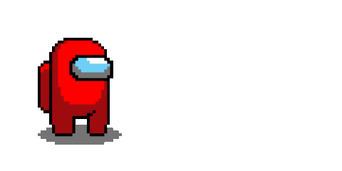

 

 

Hi there! 

, I'm Nicolas Jiménez.

A passionate frontend developer from Colombia 🇨🇴

 

    

#### 👨‍💻 All of my projects are available at: [https://nicolas-alt.vercel.app/](https://nicolas-alt.vercel.app/)

 

<!-- Connect -->
<h3 align="center">Get in touch with me:</h3>
    
      

